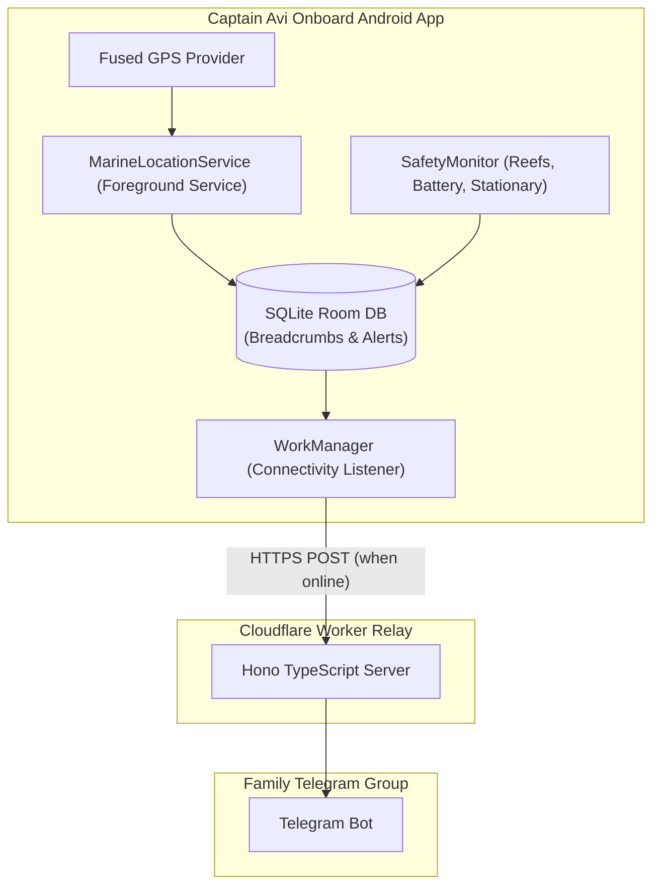

# 🎣 Captain Avi — Offline-First Marine Safety & Navigation System

**Captain Avi** is an offline-first marine safety and navigation application designed specifically for fishermen operating outside cellular coverage, and their families on shore.

---

## 🌟 Core Capabilities

1. **Continuous Offline GPS Navigation**:
   - High-contrast, sunlight-visible Marine Helm with **Speed in Knots (KT)**, **Bearing**, and **Heading**.
   - **Return-to-Home Bearing Needle**: Real-time compass arrow pointing directly back to the home harbour with distance in Nautical Miles (NM).
   - **Offline Marine Chart**: Rotatable chart (two-finger twist + heading-up mode) rendering tracked breadcrumb paths, fishing hotspots, and bundled Maldives OneMap coral-reef hazard polygons.
   - **Basemaps**: Selectable Esri satellite imagery and Carto/OpenStreetMap street map; reef, RTL ferry, and optional OpenSeaMap overlays remain available.

2. **Autonomous Marine Safety Engine**:
   - **🚨 One-Button Distress SOS**: Sounds loud siren, triggers rhythmic vibration patterns, and queues urgent emergency broadcasts with live GPS coordinates.
   - **⚠️ Danger Reef Proximity Alarms**: Warns whenever the vessel approaches shallow breakers or charted coral heads.
   - **🪫 Low-Battery Warnings**: Audio alert at 15% and 5% battery to ensure power banks are connected.
   - **⚓ Stationary / Drift Detection**: Alerts if the vessel has stopped moving for > 30 minutes.
   - **🌊 Safe Geofence Boundary**: Alerts if the vessel travels farther than the safe home radius (e.g. > 15 NM).
   - **⛈️ Storm / High-Wave Forecast Alerts**: Checks the marine forecast near the last known position every few hours and pushes a local notification if wave height, swell, or wind gusts cross your configured thresholds — before you even leave the dock.

3. **Offline Queue & Automatic Telegram Resync**:
   - Operates seamlessly with zero cellular reception using local **SQLite Room Database**.
   - When mobile internet or Wi-Fi reconnects, Android **WorkManager** automatically drains the outbox queue and sends:
     - 🎣 Fishing trip started/ended reports
     - 📍 Periodic live location updates with clickable Google Maps links
     - 🚨 Instant SOS alerts
     - 📶 Reconnection summary containing all offline stored breadcrumbs and last confirmed GPS coordinates.

4. **Zero-Token APK Security**:
   - The Telegram Bot token is never stored in the Android APK.
   - Updates are relayed through a private **Cloudflare Worker / Node.js Relay Service**.

---

## 🏗️ System Architecture



---

## 🚀 Quick Setup Guide

### 1. Set Up Telegram Bot (5 Minutes)
1. Open Telegram and message `@BotFather` to create a new bot (e.g. `@CaptainAvi_bot`). Note down your `TELEGRAM_BOT_TOKEN`.
2. Create a Telegram Group with family members, add your bot to the group, and make it an admin.
3. Retrieve your `TELEGRAM_CHAT_ID` (using `@getidsbot` or Telegram API).

### 2. Deploy the Cloudflare Relay Server
```bash
cd relay
npm install

# Configure secrets in Cloudflare Workers
npx wrangler secret put TELEGRAM_BOT_TOKEN
npx wrangler secret put TELEGRAM_CHAT_ID

# Deploy
npm run deploy
```
Your relay URL will be: `https://captain-avi-relay.<your-subdomain>.workers.dev`.

### 3. Configure Android App
1. Open **Captain Avi** on the fisherman's phone.
2. Tap **CONFIG (Settings)** in the bottom navigation.
3. Enter your **Captain Name** and paste your **Relay Server Endpoint URL**.
4. Tap **SAVE CONFIG**.
5. Tap **START FISHING TRIP** on the Helm when leaving port!

---

## 📁 Repository Structure

```
captainavi/
├── android/                        # Android Kotlin Jetpack Compose Project
│   ├── app/
│   │   ├── src/main/java/com/captainavi/app/
│   │   │   ├── CaptainAviApp.kt    # Application initializer
│   │   │   ├── MainActivity.kt     # Activity & permission orchestration
│   │   │   ├── data/               # Room DB entities, DAOs, & Repositories
│   │   │   ├── safety/             # SafetyMonitor, NauticalMath, AudioAlarmManager
│   │   │   ├── service/            # MarineLocationService & ConnectivitySyncWorker
│   │   │   └── ui/                 # Marine theme, Helm HUD, Chart, Waypoints, History
│   │   └── build.gradle.kts
│   └── settings.gradle.kts
└── relay/                          # Cloudflare Worker / Node.js Relay Server
    ├── src/
    │   ├── index.ts                # Telegram dispatch & batch formatters
    │   └── index.test.ts           # Unit tests
    ├── wrangler.toml
    └── package.json
```
